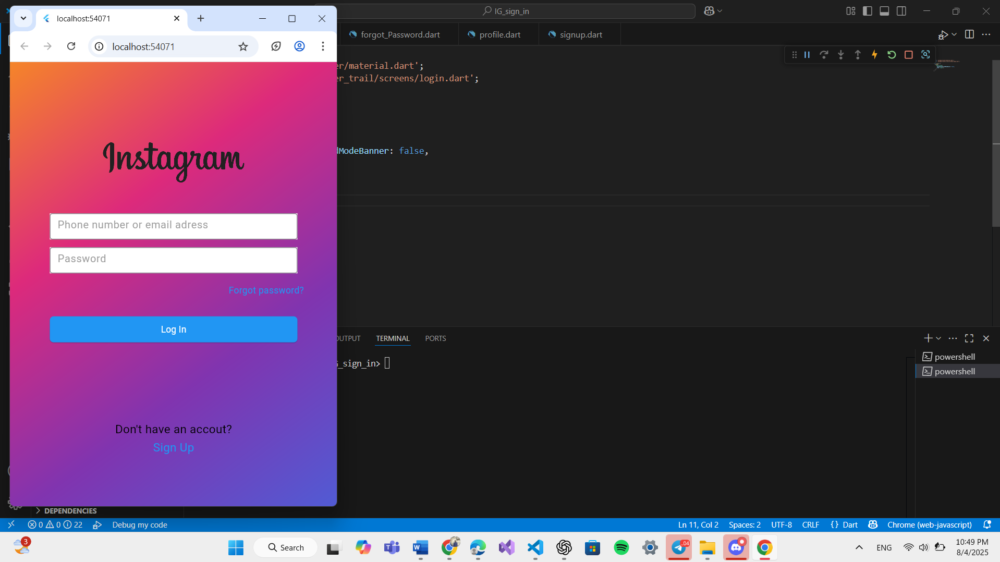
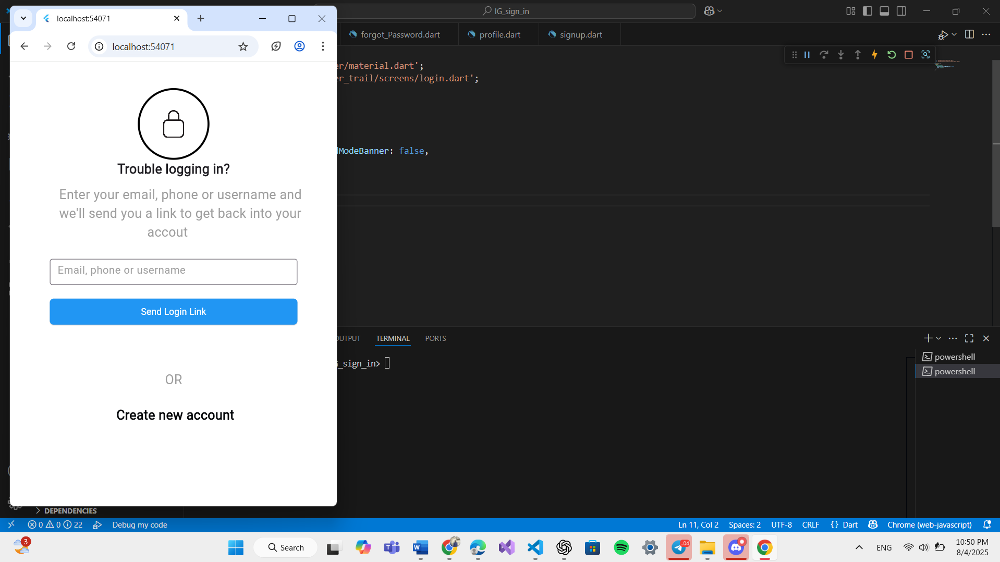
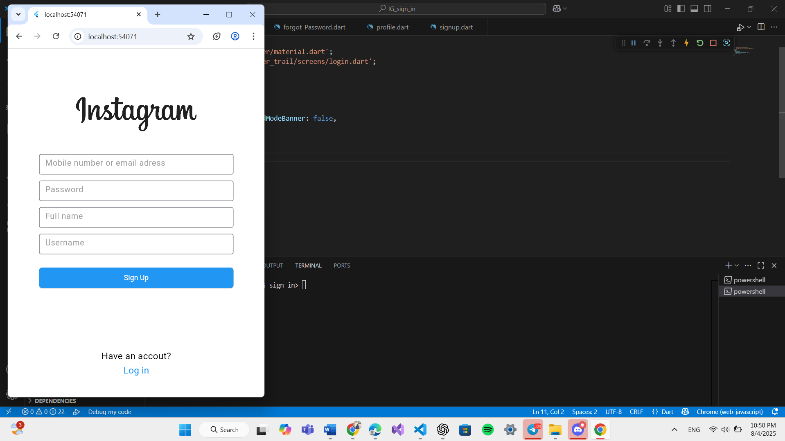

# IG Login UI

This is a Flutter project that implements an Instagram-style login user interface with form validation and navigation between login, signup, forgot password, and profile screens.

## Features

- Responsive Instagram-inspired login UI design with a beautiful gradient background  
- Form validation for email/phone and password fields to ensure correct input  
- Navigation between Login, Signup, Forgot Password, and Profile screens  
- Custom reusable text field widget with validation support for cleaner code  
- Simple and clean code structure, easy to customize and extend  

## Screenshots

  
  
 
 
  


## Getting Started

These instructions will help you run the project on your local machine.

### Prerequisites

- Flutter SDK installed. Follow the official guide: [Flutter installation](https://flutter.dev/docs/get-started/install)  
- An editor like VS Code or Android Studio  

### Installation

1. Clone the repository:
   ```bash
   git clone https://github.com/omarnassar64/IG-Login-UI.git
Navigate to the project directory:

bash
Copy
Edit
cd IG-Login-UI
Get the Flutter packages:

bash
Copy
Edit
flutter pub get
Run the app:

bash
Copy
Edit
flutter run
Folder Structure
lib/screens/ - Contains the UI screens: Login, Signup, ForgotPassword, Profile

lib/widgets/ - Contains reusable widgets like the CustomTextField

lib/main.dart - The main entry point of the app

About Me
I am Omar Nassar, an Electrical and Software Engineer passionate about cross-platform development and building real-time IoT and Robotics projects integrated with Flutter applications.

GitHub: https://github.com/omarnassar64

Feel free to contact me for freelance work or collaboration!

License
This project is open source and free to use.

Thank you for checking out my project!
If you have any questions or want to collaborate, don’t hesitate to reach out.

Copy
Edit
